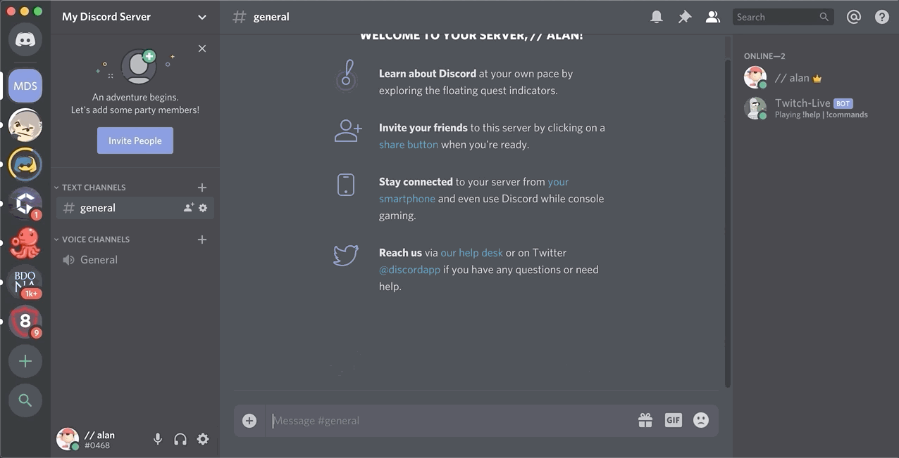

# discord-bot
 Utilized the discord.py library and Twitch API to create a discord bot that allows you to add Twitch streamers to a list and you're able to manually check if they are live.

## Help command

## List of commands

## Add command

#### Adding multiple

## List command

## Live command

## Remove command

#### Removing multiple

## Remove all command

